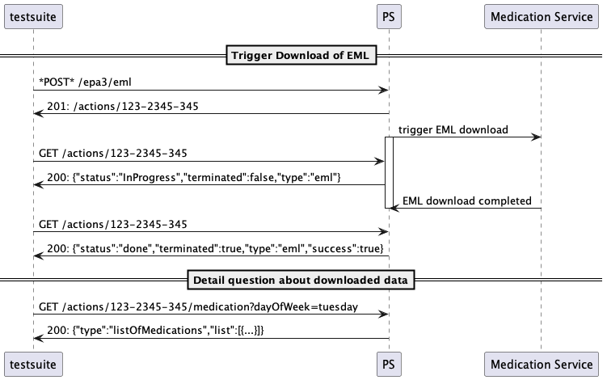
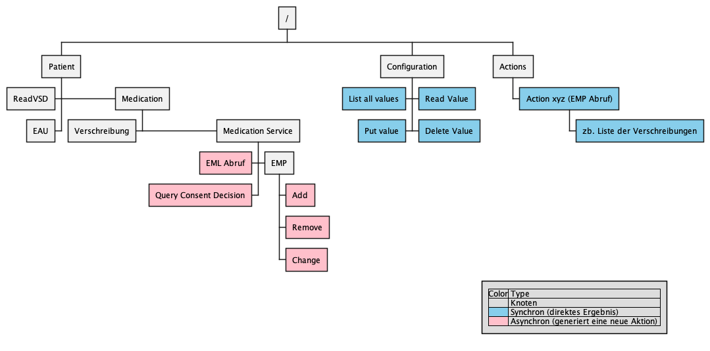

# Testtreiberschnittstelle Primärsysteme 

Dokumentation der Testtreiberschnittstelle der gematik für Primärsysteme.

## Motivation: Warum?

Die Motivation hinter der Testtreiberschnittstelle lässt sich in zwei Punkten zusammenfassen:
* Konkret ist es für den Test des EMP Downloads notwendig, die interne Datenhaltung der Primärsysteme abzufragen.
* Allgemein ist es für die gematik und auch die Hersteller wünschenswert, dass die Primärsysteme in Zukunft leichter testbar sind.

Warum ist diese Testbarkeit wichtig?
* Die gematik-Testsuiten können in Prozesse der Hersteller eingebaut werden (CI, Regression Testing). 
Gerade kleinere Hersteller erhalten so ein Werkzeug, um einfacher und schneller zu testen.
* Es ist angedacht, KOBs auch für andere Anwendungen zu verwenden. Die Testbarkeit der Primärsysteme ist dafür eine 
Grundvoraussetzung. Auf lange Sicht ist der Schritt daher unvermeidbar, und je früher wir (gematik) die Schnittstelle veröffentlichen, desto schneller amortisieren sich die Investitionen für Hersteller.
* Die gematik kann und will zukünftig mehr und kleinschrittiger Testsuiten für Primärsysteme bereitstellen. Diese werden mehr und heftiger Gebrauch einer solchen Schnittstelle machen.

## Grundprinzipien der Schnittstelle

Die Schnittstelle...

* ...soll für möglichst alle derzeitigen und zukünftigen Anwendungen der gematik nutzbar sein.
* ...muss mit möglichst geringem Aufwand und mit möglichst kleinem Overhead von den Herstellern umsetzbar sein.
* ...soll robust in einer vielzahl von Szenarien einsetzbar sein.
* ...soll transparent einsehbar in einem git-repo beschrieben sein.
* ...soll eine iterative Erweiterung unterstützen.
* ...ist versioniert über MediaTypes (Das PS muss in der Content-Negotiation nicht unterstützte Anfrage-Versionen ablehnen)

## Aufbau (Stand jetzt noch in der Diskussion)

* Github-Repo
* REST-API mit OpenAPI Beschreibung
* Zentraler Key/Value store für die Konfiguration
* Operationen sind High-Level (also "Rufe den Medikationsplan für den Patienten ab", nicht "Mach ein VAU-Login")

### Warum REST?

REST scheint möglicherweise eine komische Wahl zu sein. Long-Runner Requests, komplizierte Netzwerk-Setups... das 
klingt eher nach MQ, SSE oder STOMP. REST wird hier vor allem aus Gründen der Einfachheit genommen. Die Schnittstelle 
soll so einfach wie möglich sein. REST ist ein bekanntes Paradigma, das von vielen Entwicklern verstanden wird und 
von vielen Tools unterstützt wird. Im Interesse der Einfachheit wird daher auf REST gesetzt.

### Infrastruktur

* Infrastruktur ist auch ansprechbar. Zb Kartenterminal (oder Konnektor etc...).
* Die Testsuite definiert die Namen. (KartenterminalA, KartenterminalB, Konnektor)
* In der Testsuite kann direkt eine URL für jede Komponente hinterlegt werden.
** Alternativ wäre es schön, wenn über das PS direkt eine Liste abgefragt werden kann und das Testsetup automatisiert "entdeckt" werden kann
* Für die Komponenten existieren eigene Testtreiber-APIs (zb Admin-Schnittstelle für Konnektor...)
* Wenn keine Schnittstelle vorhanden ist (oder keine automatisierung umgesetzt wurde) muss die angeforderte Aktion schriftlich in der UI der Testsuite beschrieben werden (zb: "EGK an Kartenterminal A jetzt einstecken")

## Ablauf von Aktionen

Die REST-Operationen gliedern sich in einen synchronen und einen asynchronen Teil. Synchrone Operationen können vom Primärsystem 
direkt beantwortet werden, Asynchrone Operationen benötigen eine längere Bearbeitungszeit. Sie werden daher "Aktionen" genannt.

Aktionen werden asynchron abgearbeitet:
* POST für neue Aktion (zb. POST /epa3/emp)
* Als Response kommt ein 201 Created mit einem "Location"-Header zurück.
* Die verlinkte Ressource repräsentiert den Zustand der Aktion.
* Vorteil: Es muss auch bei langen Wartezeiten (zb beim Stecken von mehreren echten Karten) kein Timeout befürchtet werden.
* Kleinere Abfragen (zb bei der EML das Abfragen von einzelnen Daten) kann dann wieder synchron auf der Ergebnis-Ressource durchgeführt werden

## Aufbau der API

Die Operationen sind logisch angeordnet. Das bedeutet, das die Clusterung nicht nach gematik-Anwendungen erfolgt, sondern nach Use-Cases für die Anwender. Dadurch soll eine Entkopplung von den gematik-Produkten und -Strukturen erreicht werden. Eine Aktion kann also eine Interaktion mit mehreren Fachdiensten aus mehreren gematik-Produkten zur Folge haben. Sie könnte aber auch Standalone abgearbeitet werden.

Der folgende Baum ist noch KEINE konkrete REST-Struktur. Es geht hier um die grobe (und zum Teil beispielhafte) Anordnung der Aktionen.

* Frage zu klären: Wie gehen wir mit Fehlerhaften Ergebnissen um?
* Frage zu klären: "Fehlerkonfiguration" (zb. schon abgelaufener Timer von 25 Stunden ohne 25 Stunden zu warten)

## License

Copyright [Jahr] gematik GmbH

Licensed under the Apache License, Version 2.0 (the "License"); you may not use this file except in compliance with the License.

See the [LICENSE](./LICENSE) for the specific language governing permissions and limitations under the License.

Unless required by applicable law the software is provided "as is" without warranty of any kind, either express or implied, including, but not limited to, the warranties of fitness for a particular purpose, merchantability, and/or non-infringement. The authors or copyright holders shall not be liable in any manner whatsoever for any damages or other claims arising from, out of or in connection with the software or the use or other dealings with the software, whether in an action of contract, tort, or otherwise.

The software is the result of research and development activities, therefore not necessarily quality assured and without the character of a liable product. For this reason, gematik does not provide any support or other user assistance (unless otherwise stated in individual cases and without justification of a legal obligation). Furthermore, there is no claim to further development and adaptation of the results to a more current state of the art.

Gematik may remove published results temporarily or permanently from the place of publication at any time without prior notice or justification.

